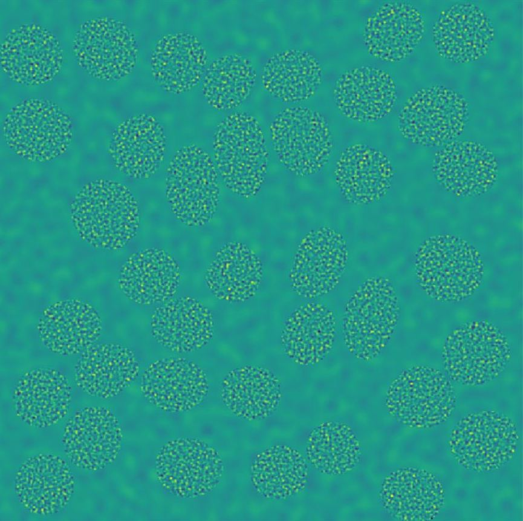
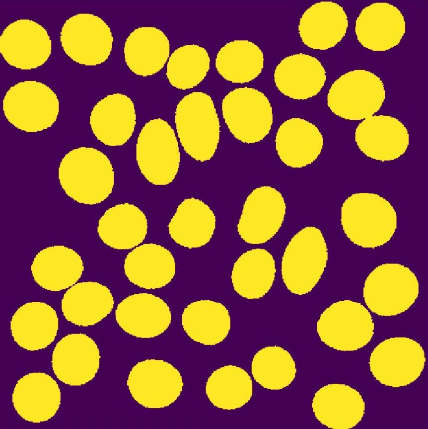
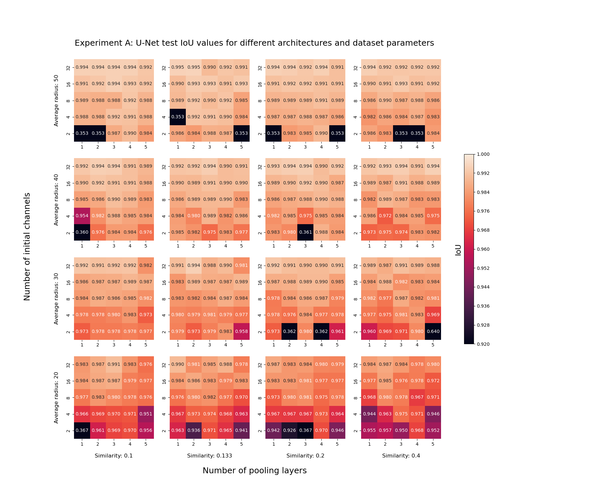
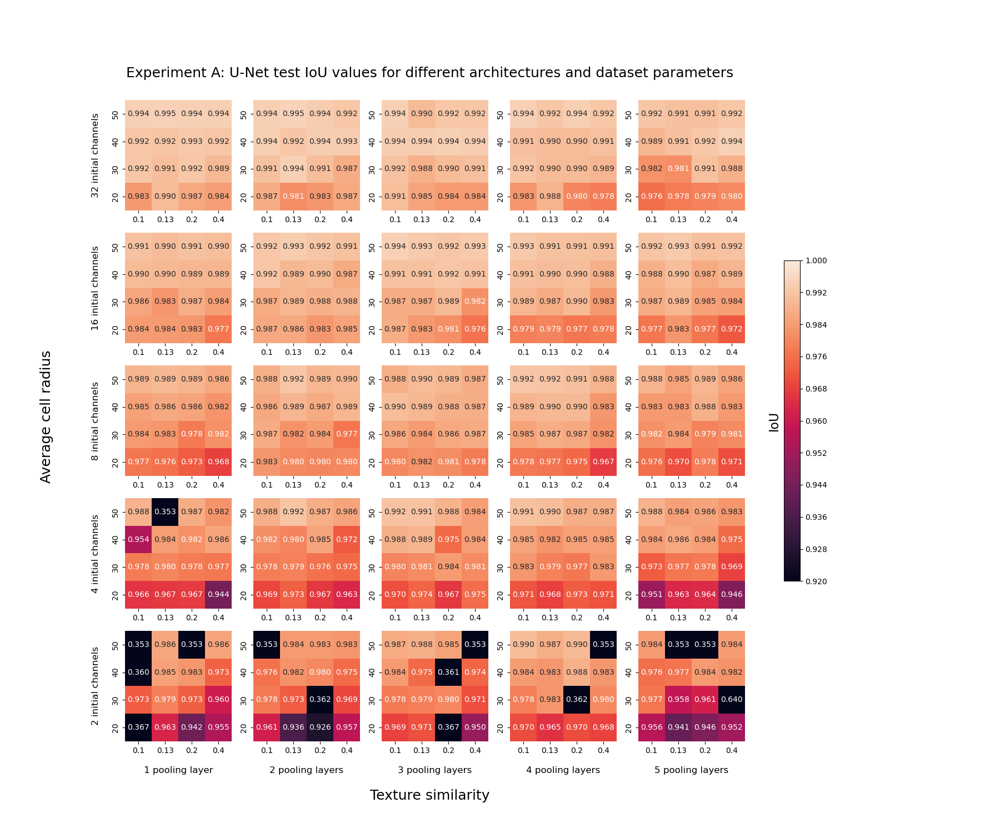
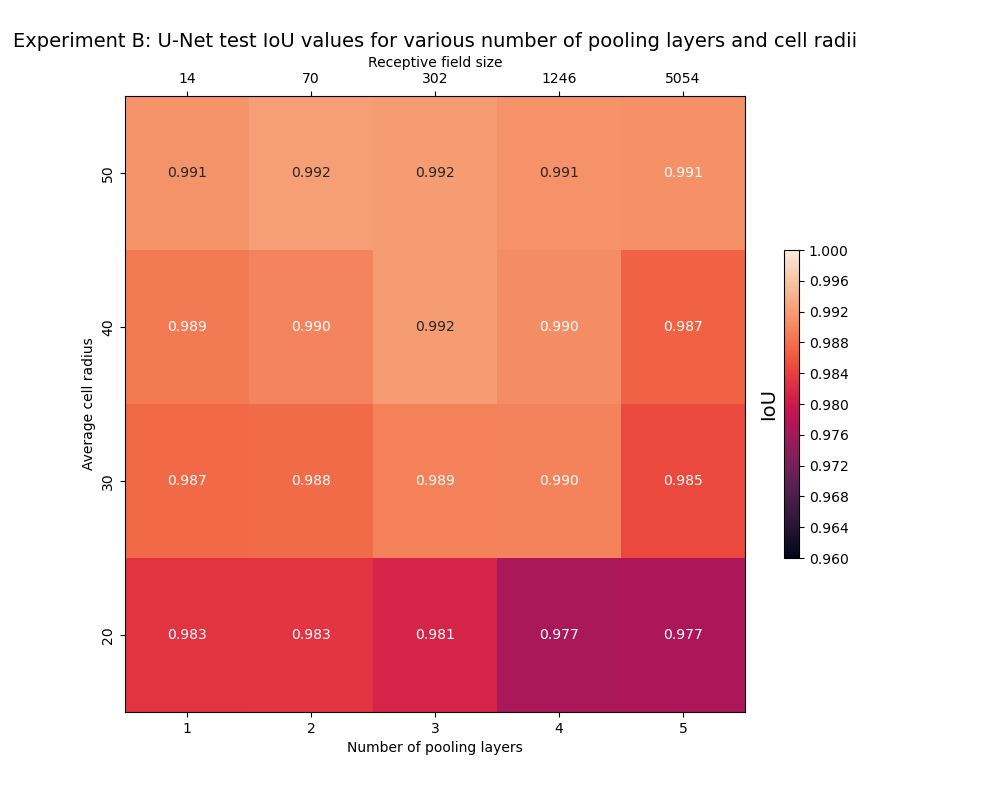
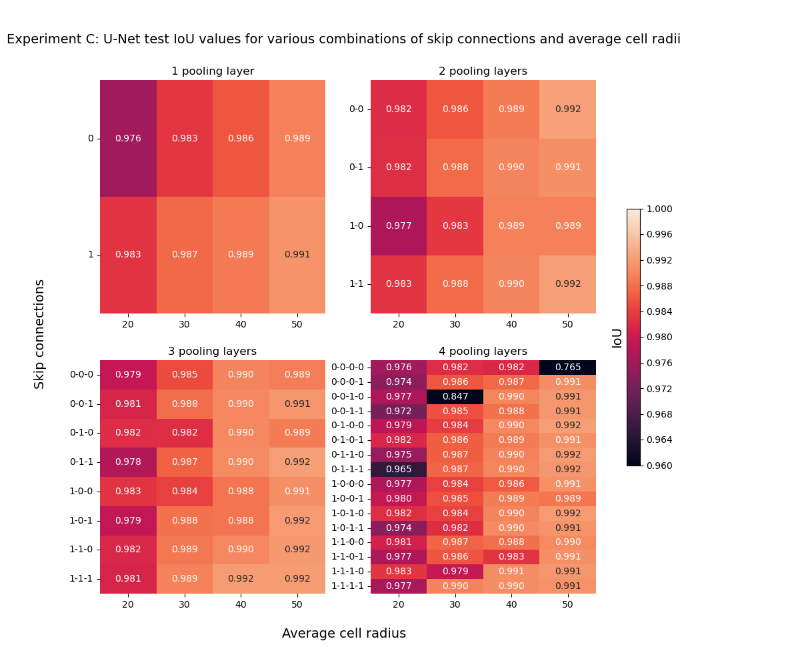

# Optimal U-Net for Image Segmentation
 
**CS-433 Machine Learning: Project 2**

**Team**: Antoine Bonnet, Daniel Demko, Louca Gerussi

Supervised by Prof. Daniel Sage

## Table of contents

[Project description](#project-description)

[Data generation](#data-generation)

[Experiments](#experiments)
- [Experiment A](#experiment-a-architecture-and-dataset-parameters)
- [Experiment B](#experiment-b-receptive-field)
- [Experiment C](#experiment-c-skip-connections)

[Running experiments](#running-experiments)

[Report](#report)


## Project description 

The U-net is an effective network architecture for semantic segmentation of images (a.k.a pixel classification). This is typically used to quantify images in biology/microscopy. The pooling and the skip connection are the crucial elements of the U-Net architecture. The pooling downsamples the image in order to address visual features at different scales meanwhile the skip connections combining the features of the different scales. There is a strong analogy with the pyramid / multiscale / wavelets approaches used in image processing.

In this project, we propose to better understand the role of the pooling and the skip connections supervised training with a limited number of classes (e.g. background/cytoplasm). We would like to 1) determine a relationship between the number of pooling steps, the receptive fields and the distribution of size of objects of the labelled images, 2) determine an automatic way to select the type of pooling (max, average, stride, …) based on the image statistics, and 3) show the interests to have the skip connection at every scales

These established relationships could allow to minimize the size of the U-net for a given image segmentation problem, which would facilitate the training.


## Data generation
### Description
Due to the difficulty of obtaining real cellular images with labelled segments, we opt to generate synthetic images of cells. 
To do so, we create (512 x 512) images covered with 40% of oval cells of uniformly random orientation. From a given average radius $r$, cells are generated as ovals with horizontal and vertical radii $\sim \mathcal{N}(r, 1)$, which are then deformed with an elastic deformation. The background and cell zones is respectively textured with a difference of Gaussians applied on normal random noise with different standard deviations. For each set of standard deviations and average cell sizes, we create a dataset of 100 training images and their associated labels, as well as 100 test images and labels. An example is shown in `data_synthesis/data_synthesis.ipynb`. 

We show an example image and its corresponding label with radius 30 and similarity 20% below. 

<p align="center">
  
&nbsp; &nbsp; &nbsp; &nbsp;
  
</p>

### Generation
We included the generated datasets in the `data_synthesis/generated_datasets/` folder, which were generated by running the `data_synthesis/generate_datasets.sh` script. Please note that generating datasets can take a long time, and might produce different results than those provided. The core functions are in `data_synthesis/data_synthesis.py`, and the script calls these functions to generate the datasets.

Each dataset is stored in a folder with the following structure: 

```
data_synthesis/generated_datasets/
  dataset_name/
      train/
          images/
              001.tif
              002.tif
              ...
          labels/
              001.tif
              002.tif
              ...
      test/
          images/
              001.tif
              002.tif
              ...
          labels/
              001.tif
              002.tif
              ...
```

The `dataset_name` is of the form `dataset_rad{avg_radius}_sig{similarity}`. For example, the dataset with average radius 30 and similarity 20% is stored in the folder `dataset_rad30_sig5.0`.

## Experiments

### Experiment A: Architecture and dataset parameters

**Goal**: Analyze the effect of data parameters (average cell radius and texture similarity) and U-Net parameters (number of initial channels and number of pooling layers) on the performance of the image segmentation model. 

**Architecture parameters**: A U-net is composed of two paths: the encoder and the decoder. The encoder (or contractive) path of the network processes the input image and extracts high-level features, while the decoder (or expansive) path of the network uses these features to generate a detailed output image. Every pooling layer in the encoding (or contractive) path is matched by an upsampling layer in the decoding (or expansive) path.

- *Number of pooling layers*: A pooling layer is used in the encoding path to downsample the spatial resolution of the input data. This is typically done by applying a pooling function, such as maximum pooling or average pooling, to the input data within a local region. The use of pooling layers can help to reduce the computational complexity of the network and improve its ability to learn high-level features from the input data. 

- *Number of initial channels*: a channel refers to a dimension of the input data that corresponds to a specific feature or attribute. The number of initial channels is the number of channels at the first layer, then for every layer in the contractive path we downsample by 2 (divide resolution of image by 2) but double the number of channels. 

- *Skip connections*: Each layer of a U-Net may contain a skip connection by adding a direct connection between the encoder and decoder parts of the network. The skip connections allow the decoder to directly access the high-level features extracted by the encoder, rather than having to learn these features on its own. Skip connections can help the U-Net model to learn more efficiently, by allowing the decoder to make use of information that has already been learned by the encoder. This can also help the model to produce more accurate results, by allowing it to incorporate both low-level and high-level information from the input image.

<p align="center">
  
</p>


**Dataset parameters**: These are the only two parameters which we vary in our data generation process. 

- *Average radius of cells*: Average horizontal and vertical radius of each oval cell.  
- *Similarity*: Ratio of the standard deviation of the background to that of the cells. The higher the similarity, the less noticeable is the difference between cell and background in the input images.

**Method**

    For each combination of data parameters (`avg_radius`, `similarity`): 
         For each combination of architecture parameters (`num_pools`, `num_channels`): 
              1. Train a U-net on training set with (`avg_radius`, `similarity`) using parameters (`num_pools`, `num_channels`). 
              2. Predict on test set and compute weighted IoU. 

**Result**

<p align="center">
  
</p>

<p align="center">
  
</p>

### Experiment B: Receptive field

**Goal**: Determine a relationship between the number of pooling steps, the receptive fields and the distribution of size of objects of the labelled images

**Hypothesis**: Our intuition is that
- Larger objects will require a larger receptive field to be appropriately segmented (and not split into several sub-objects), and so a higher number of pooling layers will favor the IoU. 
- Higher similarity will lead to more local minima in the optimization landscape, harder to optimize, decreased final IoU. 

**Method**: We will test these intuitions by training a U-net on two separate series of dataset (one which varies the size of cells and the other which varies the texture similarity) with various combinations of `n_pools` and `n_channels`. We compute its performance as its IoU weighted by class density. 

    For various values of `num_pools`: 

    1. Compute receptive field of U-Net with `num_pools` pooling layers. 

        a. Visualize the relationship between pooling layers and receptive field. 

    2. For different datasets with various `avg_radius` values: 
        a. Train a U-Net with `num_pools` pooling layers on the dataset with `avg_radius`. 
        b. Generate predictions with this trained U-net on the test set and compute the average median radius of label objects. 
        
    3. Visualize the relationship between pooling layers, average radius and distribution of label objects using a heatmap. 
        
**Result**

<p align="center">
  
</p>


### Experiment C: Skip connections

**Goal**: Determine the effect of skip connections on the performance of a U-net for varying scales of cells and number pooling layers. 

**Method**
    
    1. For each `num_pools`: 
        2. For each combination of `skip_connections` (e.g. 00, 01, 10, 11 for `num_pools = 2`):
            a. Train a U-Net with given `skip connections` and `num_pools` on a fixed training set. 
            b. Predict on test set and compute the weighted IoU

**Result**

<p align="center">
  
</p>

## Running experiments
To set up the environment, you will find the conda environnment file [here](./environment.yml). If using pip, you can find the requirments [here](./requirements.txt).

To generate the datasets, you can execute `cd data_synthesis`and then execute the bash file as follows: `./generate_datasets.sh`. 

All of the experiments can be run and visualized in the `u_net/unet.ipynb` notebook. In addition, we provide an example for training and testing on a specific dataset that can be ran separately to vizualise the results of one run. We also provide the results of the experiments in the `plots/` folder.

The results of the experiments are stored in the `results/` folder. It will contain a saved snapshot of the trained model where the name is the combination of the parameters used to train the model and the parameters of the datasets as follow: 
`rad{avg_radius}_sig{sigma_back}_ch{num_channels}_pools{num_pools}_{pool_type}_stride{pool_stride}_skip{skip_layer_combination}_{epochs}E`

Both training and testing takes a long time, so all of the results for the IoU are provided in a csv file `results/log.csv` and `results/log2.csv` (we ran the experiments twice, both could be used to generate the plots), and will be automatically used for the plot generation if they appear in there.

## Report

The full report can be found [here](./report/U_Net_for_Image_Segmentation.pdf).
